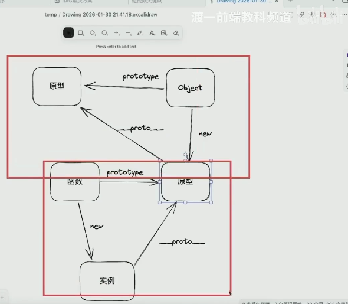

# 原型链只要记住三角关系即可，剩下都是推到

比如函数的prototype指向他的原型，那么函数new出来的实例，*proto*则指向原型，这个原型也是obj new出来的，obj的prototype也有原型，这样

只不过顶点原型obj指向Null

const obj={} ,实际上就是new 出来

1. React 的 Scheduler 是独立于 React 的包，它是怎么实现时间切片的？为什么用 MessageChannel 而不是 setTimeout(fn, 0)？
2. React 的任务优先级有几种？用户点击、网络请求、动画分别对应什么优先级？
3. 什么是 useId？解决了什么问题？和 SSR 有什么关系？
