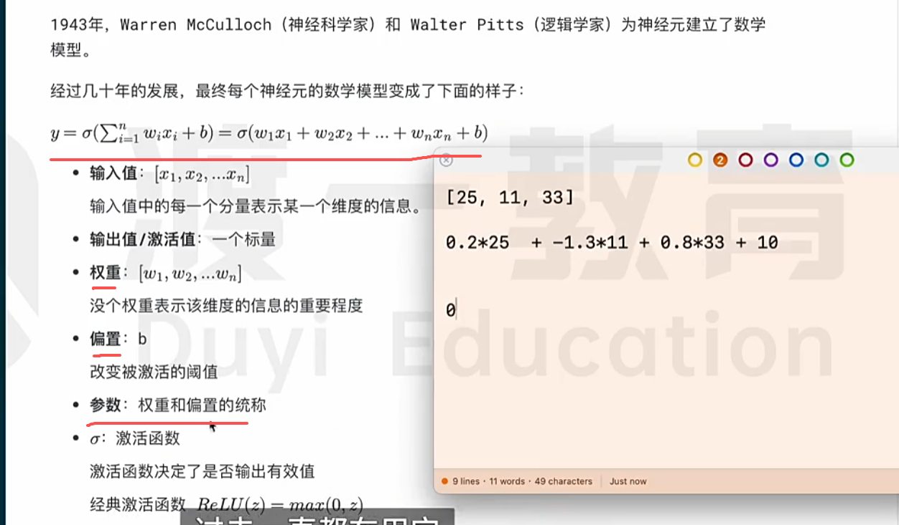

 
# 哲学流派

1. 符号主义：智能=逻辑推算，比如机器小车比赛，就是告诉他规则，算法，他计算路线

2. 连接主义：智能=大脑结构，不能靠逻辑推演，不然太庞大，应该像神经系统，他自己推算。

3. 行为主义：智能=环境互动

# 要解决的问题

1. 自然语言处理

2. 语音技术

3. 计算机视觉

# 神经元

比如一个人贷款的公式，年龄*权重+年薪*权重+信用*权重+偏执

一般就是有个公式计算，有权重和偏执影响，然后一个人是30岁，30年薪和信用650，通过公式算出能贷款1W，但人为觉得应该是2W，就需要去调权重和偏执。 然后另一个是25岁，10年薪和信用500，通过之前的参数能贷款1W，但人为觉得只能1000，所以又要调节，但是又不能影响之前的结果。  

# 所以 这就要参数（权重+偏执） ，现在神经网络有几万亿参数

我们训练模型，本质就是让机器如果智能的调节参数，达到我们预期。