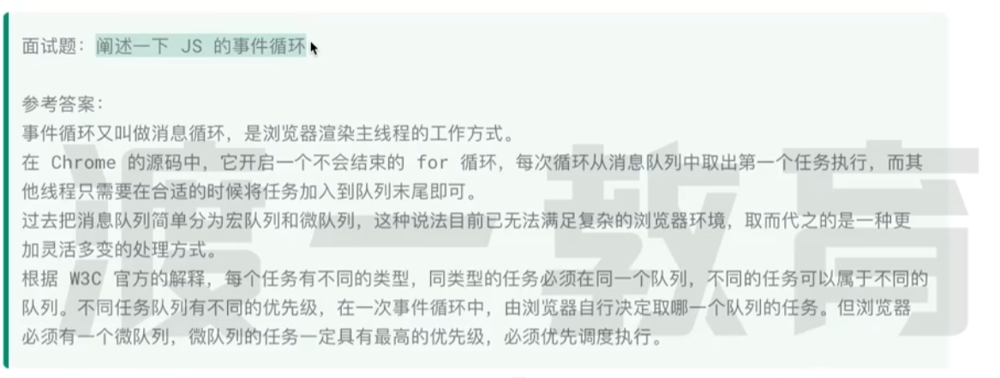

 
# 进程

浏览器可以打开不同标签页，一个标签页有一个进程，打开多了就吃内存。  进程会启动一个渲染 主线程 ，主线程负责 HTML CSS JS等代码执行

# 浏览器遇到的问题

1. 当我在处理函数的时候，突然用户点击一个按钮，我怎么办？

2. 处理函数的时候，定时器到了，怎么办？

3. 处理函数的时候，用户点击按钮和定时器到了，怎么办？

浏览器想出解决方法：排队 --> 事件队列

# 何为异步

代码处理 过程中，会遇到一些无法立即处理的任务：1. 定时器  2.xhr 网络请求 3.用户点击后需要执行 addeventlistener
如果让主线程渲染等待这些完成，会造成堵塞，但主线程无论如何都不能堵塞，所以选择异步来处理。

# 面试题： 如何理解 js 异步  （注意，其实有很多线程，但渲染主线程只有一个，像异步其实是交给其他线程处理

因为 js 是单线程语言，因为在浏览器渲染在渲染主线程中，而渲染主线程只有一个，他负责执行 js 渲染页面等诸多任务，所以如果同步，有可能造成主线程产生阻塞，从而导致任务队列其他任务无法执行，一方面导致繁忙的主线程白白浪费消耗时间，另一方面导致页面无法及时更新 ，给用户造成卡死现象。

# 任务有没有优先级？？？  最新没有宏任务，是多任务

任务没有优先级，但是！消息队列有优先级！

根据w3c最新解释，每个任务都有一个任务类型，同一个类型的比如放一个队列（比如点击事件放点击事件队列，网络请求放网络请求队列），不同类型的任务可以分属不同队列，在一次事件循环，浏览器可以根据实际情况从不同 队列取出任务执行（所以 ，不同 浏览器实际执行任务顺序不一样！！！）

每个浏览器必须准备一个微队列，微队列的任务优先级优先于其他 任务 执行

# 目前谷歌浏览器有哪些队列？至少有以下

1. 延时队列：存放定时器的回调任务，优先级 ： 中
2. 交互队列：存在用户交互后的事件处理任务（滚动，鼠标点击），优先级： 高
3. 微队列：用户存在需要最快执行的任务，优先级：最高

记住，必须主线程同步执行完毕，才会执行异步！ 比如 定时器0秒 睡死1秒 执行log， 同步任务是睡死1秒，log，执行完毕后执行定时器！
