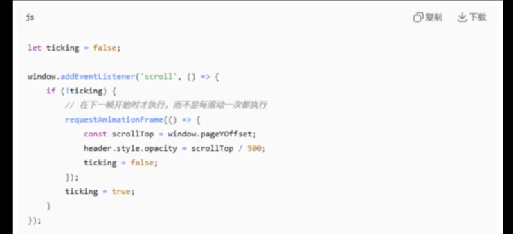

<!--
 * @Author: ctrey ctrey@qq.com
 * @Date: 2026-07-25 09:21:03
 * @LastEditors: ctrey ctrey@qq.com
 * @LastEditTime: 2026-07-31 23:37:29
 * @FilePath: \webgis-frontend-interview-handbook\页面大数据优化方案\1.页面滚动卡顿大量数据渲染.md
 * @Description: 这是默认设置,请设置`customMade`, 打开koroFileHeader查看配置 进行设置: https://github.com/OBKoro1/koro1FileHeader/wiki/%E9%85%8D%E7%BD%AE
-->
# 浏览器帧渲染流水线，一帧发生了什么

浏览器目的是60fps的速度渲染页面，也就是每帧16.6毫秒，如果一帧超过16.6毫秒页面就会感受卡顿。

js执行（requestanimation）-》layout(重排，强制同步布局)-》paint(重绘)-》composite(合成层)

js执行：执行js代码，包括事件回调，定时器，promise等。
style：计算元素最终样式
layout重排：计算每个元素几何信息（位置大小），这也是最耗时操作之一 （ 宽高，编剧，display none , 字体大小，添加删除元素，改变窗口
paint重绘：将元素绘制成像素 （颜色，可见性visibility ，透明度，不提升合成层时，边框样式 border-style
composite合成：将多个图层合并成最终的屏幕图像 ( transform ,opacity(提升合成层后)

关键点：layout和paint是性能瓶颈主要来源。

# 强制同步布局，常见性能杀手

正常流程：js执行完-》浏览器统一做layout
强制同步布局：在js修改样式，读取几何属性（offsettop,clientheight,getcomputedstyle),会触发立即执行layout，然后再执行Js

比如for循环读取offsetheight，就会连续触发layout，后面div.style.height=height+10 ,这样如果循环1000次，就连续1000次触发layout
这样就会导致layout thrashing(布局抖动)，当强制同步布局反复发生时候，页面会抖动，每一帧都在计算布局，性能急剧下降

解决方案： 读写分离
先for读取全部的offsethgiht,然后再for修改。

# 问题 ， 监听页面滚动，在滚动中获取pageOffset，然后修改样式，造成同步布局

解决方案

1. 在scrool,callback,第三个参数写 passive:true,告诉浏览器先方向滚动，在执行回调
2. 将callback放入 requestanimationframe 中，在下一帧开始才执行，而不是每滚动一次都执行，保证一帧只执行一次dom.
   

# 合成层 ， 重点， 浏览器将页面分成多个图层（类似ps的图层） ， 每个图层独立绘制，最终合成最终画面，如果一个图层动了，只绘制这个图层，其他图层不动

创建合成层，就是用transform:translatez(0)这些api，或者will-change:transform或willchange:opacity

好处：动画（transform/opacity ） 只需要合成器处理，不触发layout和paint,性能极高，页面滚动时，固定定位(fixed)的元素不会触发重排

滥用危害: 不要给所有元素加will-change:transform ，每个合成层都占用内存，如果太多会内存飙升卡顿。

正确做法，在只需要动画的元素使用，并且结束后移除
